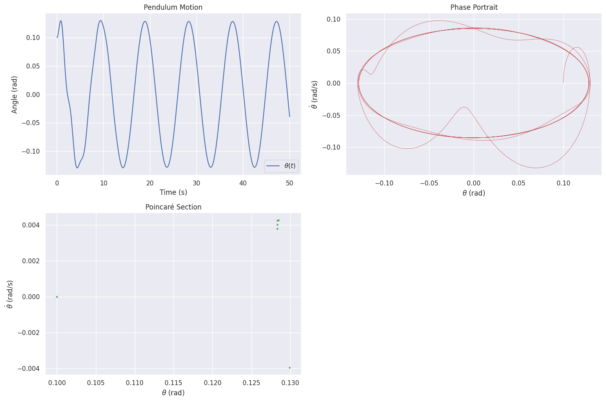

# Problem 2
# Investigating the Dynamics of a Forced Damped Pendulum

## Motivation
The forced damped pendulum is a captivating example of a physical system with intricate behavior resulting from the interplay of damping, restoring forces, and external driving forces. By introducing both damping and external periodic forcing, the system demonstrates a transition from simple harmonic motion to a rich spectrum of dynamics, including resonance, chaos, and quasiperiodic behavior. These phenomena serve as a foundation for understanding complex real-world systems, such as driven oscillators, climate systems, and mechanical structures under periodic stress.

Adding forcing introduces new parameters, such as the amplitude and frequency of the external force, which significantly affect the pendulum's behavior. By systematically varying these parameters, a diverse class of solutions can be observed, including synchronized oscillations, chaotic motion, and resonance phenomena. These behaviors not only highlight fundamental physics principles but also provide insights into engineering applications such as energy harvesting, vibration isolation, and mechanical resonance.

---

## Task 1: Theoretical Foundation

### Differential Equation
The motion of a forced damped pendulum is governed by the following nonlinear differential equation:

$$
\frac{d^2\theta}{dt^2} + b\frac{d\theta}{dt} + \frac{g}{L}\sin(\theta) = F\cos(\omega t)
$$

Where:
- \(\theta\): Angular displacement (radians)
- \(b\): Damping coefficient (s⁻¹)
- \(g\): Gravitational acceleration (m/s²)
- \(L\): Pendulum length (m)
- \(F\): Driving force amplitude (s⁻²)
- \(\omega\): Driving frequency (rad/s)

### Small-Angle Approximation
For small angles (\(\theta \ll 1\)), \(\sin(\theta) \approx \theta\), simplifying the equation to:

$$
\frac{d^2\theta}{dt^2} + b\frac{d\theta}{dt} + \omega_0^2\theta = F\cos(\omega t)
$$

Where \(\omega_0 = \sqrt{\frac{g}{L}}\) is the natural frequency. This is a linear second-order differential equation with a harmonic forcing term.

### General Solution
The general solution to this differential equation consists of two parts:
1. **Homogeneous solution (transient response):**
   $$
   \theta_h(t) = A e^{-\frac{b}{2}t} \cos(\omega_r t + \phi)
   $$

   where \(\omega_r = \sqrt{\omega_0^2 - \left(\frac{b}{2}\right)^2}\).

2. **Particular solution (steady-state response):**
   $$
   \theta_p(t) = A_p \cos(\omega t - \delta)
   $$

   where
   $$
   A_p = \frac{F}{\sqrt{(\omega_0^2 - \omega^2)^2 + (b\omega)^2}}
   $$

   and
   $$
   \delta = \tan^{-1}\left(\frac{b\omega}{\omega_0^2 - \omega^2}\right).
   $$

### Resonance
Resonance occurs when the driving frequency \(\omega\) approaches the natural frequency \(\omega_0\). For light damping (\(b \ll \omega_0\)), the amplitude \(A_p\) peaks sharply near \(\omega = \omega_0\), amplifying the system's energy significantly.

---

##  Analysis of Dynamics

### Parameter Effects
- **Damping Coefficient (b):** Higher \(b\) reduces oscillation amplitude and suppresses chaos, stabilizing the system.
- **Driving Amplitude (F):** Larger \(F\) can push the system from periodic to chaotic motion.
- **Driving Frequency (\(\omega\)):** Near \(\omega_0\), resonance amplifies motion; far from \(\omega_0\), the system may exhibit quasiperiodic or chaotic behavior.

### Transition to Chaos
For large \(F\) or specific \(\omega\), the nonlinear term \(\sin(\theta)\) dominates, leading to chaotic motion. This transition is evident in phase portraits and Poincaré sections, where trajectories shift from closed loops (periodic) to scattered points (chaotic).

---

##  Practical Applications

- **Energy Harvesting:** Oscillatory motion in forced pendulums can be converted to electrical energy.
- **Suspension Bridges:** Damping and forcing model wind-induced vibrations.
- **Oscillating Circuits:** Analogous to driven RLC circuits, where resonance and damping play similar roles.

---

##  Implementation

Below is a Python script simulating the forced damped pendulum using the 4th-order Runge-Kutta (RK4) method. It includes visualizations of motion, phase portraits, and Poincaré sections.


import numpy as np
import matplotlib.pyplot as plt
from scipy.integrate import odeint

# Parameters

# Investigating the Dynamics of a Forced Damped Pendulum

## 1. Parameters and Nonlinear Differential Equation

**Parameters:**

The equation of motion for the forced damped pendulum is given by:
**Parameters:**

-**Parameters:**

- $g = 9.81 \, \text{m/s}^2$ — Gravitational acceleration
- $L = 1.0 \, \text{m}$ — Pendulum length
- $b = 0.5 \, \text{s}^{-1}$ — Damping coefficient
- $F = 1.2 \, \text{s}^{-2}$ — Driving force amplitude
- $\omega = \frac{2}{3} \, \text{rad/s}$ — Driving frequency
- $\omega_0 = \sqrt{\frac{g}{L}}$ — Natural frequency


$$
\frac{d^2\theta}{dt^2} + b \frac{d\theta}{dt} + \frac{g}{L} \sin(\theta) = F \cos(\omega t)
$$

For small angles, we can approximate \( \sin(\theta) \approx \theta \), simplifying the equation to:

$$
\frac{d^2\theta}{dt^2} + b \frac{d\theta}{dt} + \omega_0^2 \theta = F \cos(\omega t)
$$

---

## 2. Solution of the Differential Equation

The general solution consists of two parts:

1. **Homogeneous solution** (transient solution):

$$
\theta_h(t) = A e^{-\frac{b}{2}t} \cos(\omega_r t + \phi)
$$

Where \( \omega_r = \sqrt{\omega_0^2 - \left( \frac{b}{2} \right)^2} \) is the damped natural frequency.

2. **Particular solution** (steady-state solution):

$$
\theta_p(t) = A_p \cos(\omega t - \delta)
$$

Where:
- \( A_p = \frac{F}{\sqrt{(\omega_0^2 - \omega^2)^2 + (b \omega)^2}} \)
- \( \delta = \tan^{-1} \left( \frac{b \omega}{\omega_0^2 - \omega^2} \right) \)

---

## 3. Python Code Implementation

Below is the Python code to simulate the motion of a forced damped pendulum and visualize the behavior. The simulation will observe the pendulum’s motion for different initial conditions and parameter combinations.

```python
import numpy as np
import matplotlib.pyplot as plt
from scipy.integrate import odeint

# Parameters
g = 9.81  # Gravitational acceleration (m/s^2)
L = 1.0   # Pendulum length (m)
b = 0.5   # Damping coefficient (s^-1)
F = 1.2   # Driving amplitude (s^-2)
omega = 2/3  # Driving frequency (rad/s)
omega_0 = np.sqrt(g / L)  # Natural frequency

# Differential equation
def pendulum_deriv(state, t, b, omega_0, F, omega):
    theta, theta_dot = state
    dtheta_dt = theta_dot
    dtheta_dot_dt = -b * theta_dot - omega_0**2 * np.sin(theta) + F * np.cos(omega * t)
    return [dtheta_dt, dtheta_dot_dt]

# Time array
t = np.linspace(0, 50, 10000)

# Initial conditions
theta0 = 0.1  # Initial angle (rad)
theta_dot0 = 0.0  # Initial angular velocity (rad/s)
state0 = [theta0, theta_dot0]

# Solve ODE
sol = odeint(pendulum_deriv, state0, t, args=(b, omega_0, F, omega))
theta, theta_dot = sol.T

# Poincaré section (sampling at driving period)
T = 2 * np.pi / omega  # Driving period
poincare_indices = np.arange(0, len(t), int(T / (t[1] - t[0])))
poincare_theta = theta[poincare_indices]
poincare_theta_dot = theta_dot[poincare_indices]

# Plotting
plt.figure(figsize=(15, 10))

# Time series
plt.subplot(2, 2, 1)
plt.plot(t, theta, 'b-', label=r'$\theta(t)$')
plt.xlabel('Time (s)')
plt.ylabel('Angle (rad)')
plt.title('Pendulum Motion')
plt.legend()

# Phase portrait
plt.subplot(2, 2, 2)
plt.plot(theta, theta_dot, 'r-', lw=0.5)
plt.xlabel(r'$\theta$ (rad)')
plt.ylabel(r'$\dot{\theta}$ (rad/s)')
plt.title('Phase Portrait')

# Poincaré section
plt.subplot(2, 2, 3)
plt.scatter(poincare_theta, poincare_theta_dot, s=5, c='g')
plt.xlabel(r'$\theta$ (rad)')
plt.ylabel(r'$\dot{\theta}$ (rad/s)')
plt.title('Poincaré Section')

plt.tight_layout()
plt.show()
```