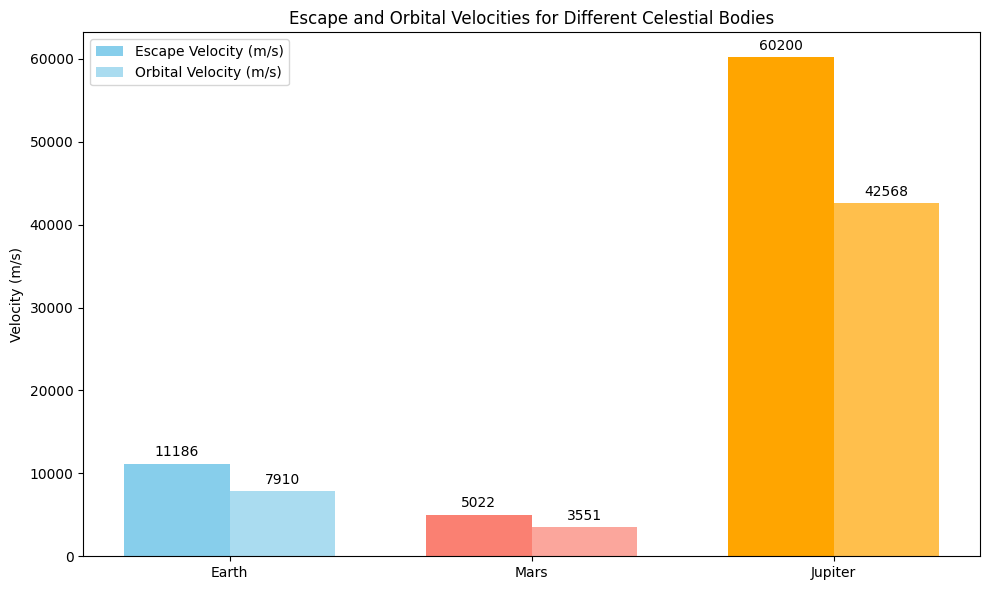

# Problem 2
# Escape Velocities and Cosmic Velocities

## Motivation
Understanding the concept of **escape velocity** and **cosmic velocities** is fundamental to space exploration. The velocity required to leave a celestial body's gravitational influence is crucial for various types of space missions, such as launching satellites, traveling between planets, and even the potential for interstellar travel. 

These velocities define the speed an object must reach to:
1. **Orbit a planet**: Achieving a stable orbit around a celestial body, such as Earth.
2. **Escape a planet's gravity**: Breaking free from the gravitational pull of a celestial body, like escaping Earth's gravitational field.
3. **Escape a star system**: Moving beyond the gravitational influence of the entire solar system or star system.

These principles are essential to the planning and execution of space missions. From satellite launches to interplanetary journeys, the first, second, and third cosmic velocities guide the required speeds for these missions.

---

## 1. Definition of Cosmic Velocities

### 1.1 Escape Velocity (First Cosmic Velocity)
The **escape velocity** is the speed an object must attain to break free from the gravitational pull of a celestial body, without further propulsion. This is the velocity required for an object to escape the gravitational field of a planet or moon.

The formula for escape velocity is:

$$
v_e = \sqrt{\frac{2 G M}{R}}
$$

Where:
- $ v_e $ = escape velocity (m/s)
- $ G $ = gravitational constant ($6.67430 \times 10^{-11} \, \text{m}^3 \, \text{kg}^{-1} \, \text{s}^{-2}$)
- $ M $ = mass of the celestial body (kg)
- $ R $ = radius of the celestial body (m)

### 1.2 First Cosmic Velocity (Orbital Velocity)
The **first cosmic velocity** is the velocity needed for an object to achieve a stable orbit around a celestial body. It is the velocity required to maintain a low Earth orbit, for example.

The formula for orbital velocity (first cosmic velocity) is:

$$
v_1 = \sqrt{\frac{G M}{R}}
$$

Where:
- $ v_1 $ = orbital velocity (m/s)
- $ M $ = mass of the celestial body (kg)
- $ R $ = radius of the celestial body (m)

### 1.3 Second Cosmic Velocity (Escape Velocity from the Star System)
The **second cosmic velocity** refers to the velocity an object must have to escape the gravitational influence of an entire star system, such as the Sun. For example, a spacecraft must achieve this velocity to leave the solar system.

The formula for the second cosmic velocity is:

$$
v_2 = \sqrt{\frac{2 G M_{\odot}}{R_{\odot}}}
$$

Where:
- $ M_{\odot} $ = mass of the Sun ($1.989 \times 10^{30} \, \text{kg}$)
- $ R_{\odot} $ = distance from the Sun to Earth ($1.496 \times 10^{11} \, \text{m}$)

### 1.4 Third Cosmic Velocity (Escape Velocity from the Galaxy)
The **third cosmic velocity** is the velocity required to escape the gravitational pull of an entire galaxy. While this is a theoretical concept, it gives insight into the extreme speeds needed for intergalactic travel.

The formula for the third cosmic velocity is:

$$
v_3 = \sqrt{\frac{2 G M_{\text{galaxy}}}{R_{\text{galaxy}}}}
$$

Where:
- $ M_{\text{galaxy}} $ = mass of the galaxy (in terms of solar masses)
- $ R_{\text{galaxy}} $ = radius of the galaxy (typically in light-years)

---

## 2. Parameters Affecting the Cosmic Velocities

Several parameters affect the calculation of these cosmic velocities:
- **Mass of the celestial body**: A greater mass increases the gravitational pull, resulting in higher velocities for both escape and orbital motions.
- **Radius of the celestial body**: A larger radius leads to a lower required velocity because the object's distance from the center of the body increases, reducing the gravitational force.
- **Gravitational constant**: This constant, $ G $, is a universal factor in gravitational calculations, affecting all the formulas.

---

## 3. Calculation and Visualization

### Python Code for Calculating Escape and Cosmic Velocities

We will now calculate and visualize the escape and orbital velocities for Earth, Mars, and Jupiter using the formulas provided.

```python
import numpy as np
import matplotlib.pyplot as plt

# Gravitational constant
G = 6.67430e-11  # m^3 kg^-1 s^-2

# Masses and radii of Earth, Mars, and Jupiter (in SI units)
celestial_bodies = {
    'Earth': {'mass': 5.972e24, 'radius': 6.371e6},
    'Mars': {'mass': 0.64171e24, 'radius': 3.396e6},
    'Jupiter': {'mass': 1.898e27, 'radius': 6.991e7}
}

# Function to calculate escape velocity
def escape_velocity(mass, radius):
    return np.sqrt(2 * G * mass / radius)

# Function to calculate orbital velocity
def orbital_velocity(mass, radius):
    return np.sqrt(G * mass / radius)

# Calculate velocities for each celestial body
escape_velocities = {}
orbital_velocities = {}

for body, params in celestial_bodies.items():
    escape_velocities[body] = escape_velocity(params['mass'], params['radius'])
    orbital_velocities[body] = orbital_velocity(params['mass'], params['radius'])

# Plotting the velocities
labels = celestial_bodies.keys()
escape_vels = list(escape_velocities.values())
orbital_vels = list(orbital_velocities.values())

x = np.arange(len(labels))

plt.figure(figsize=(10, 6))

# Plot escape velocities
plt.bar(x - 0.2, escape_vels, 0.4, label='Escape Velocity (m/s)', color='red')

# Plot orbital velocities
plt.bar(x + 0.2, orbital_vels, 0.4, label='Orbital Velocity (m/s)', color='blue')

plt.xlabel('Celestial Bodies')
plt.ylabel('Velocity (m/s)')
plt.title('Escape and Orbital Velocities for Different Celestial Bodies')
plt.xticks(x, labels)
plt.legend()

plt.tight_layout()
plt.show()
```