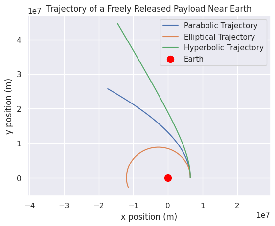

# Problem 3
# Trajectories of a Freely Released Payload Near Earth

## Introduction

When an object is released from a moving rocket near Earth, its trajectory depends on the initial conditions (such as position and velocity) and gravitational forces. The analysis of these trajectories is critical in understanding payload release during space missions, such as deploying satellites, returning objects to Earth, or escaping Earth's gravity.

The object can follow different types of trajectories based on its initial velocity and position relative to Earth. These trajectories can be:
- **Parabolic**: When the object follows a path that eventually returns to Earth.
- **Elliptical**: When the object follows an elliptical orbit around Earth.
- **Hyperbolic**: When the object escapes Earth's gravitational influence.

This document will:
1. Derive the equations of motion governing the object’s trajectory.
2. Perform a numerical simulation to compute the payload's path based on given initial conditions.
3. Discuss how these trajectories relate to orbital insertion, reentry, and escape scenarios.
4. Provide a Python tool for simulating and visualizing the object's motion.

## Equations of Motion

The motion of a payload near Earth is governed by Newton’s Law of Universal Gravitation and the principles of orbital mechanics. The gravitational force acting on the object is given by:

$$
F_{\text{gravity}} = \frac{GMm}{r^2}
$$

Where:
- \( G \) is the gravitational constant \((6.67430 \times 10^{-11} \, \text{m}^3 \text{kg}^{-1} \text{s}^{-2})\),
- \( M \) is the mass of the Earth \((5.972 \times 10^{24} \, \text{kg})\),
- \( m \) is the mass of the payload,
- \( r \) is the distance from the center of Earth to the payload.

From Newton's second law, we can compute the acceleration of the payload:

$$
a = \frac{F_{\text{gravity}}}{m} = - \frac{GM}{r^2}
$$

This results in a second-order differential equation governing the payload’s position:

$$
\frac{d^2r}{dt^2} = - \frac{GM}{r^2}
$$

Where \( r \) is the distance from the center of Earth.

The trajectory of the payload depends on its initial conditions (position and velocity) and the gravitational force acting on it. For simplicity, we will simulate the motion of the payload in a 2D plane assuming radial symmetry.

### Types of Trajectories

1. **Elliptical Trajectories**: If the payload’s velocity is less than escape velocity but sufficient to not fall back to Earth, it will follow an elliptical orbit. The general orbital equation for an elliptical orbit is:

$$
r(\theta) = \frac{a(1 - e^2)}{1 + e \cos(\theta)}
$$

Where:
- \( a \) is the semi-major axis of the ellipse,
- \( e \) is the eccentricity of the orbit,
- \( \theta \) is the true anomaly.

2. **Parabolic Trajectories**: When the initial velocity of the payload is exactly the escape velocity at a given distance, it follows a parabolic trajectory. The escape velocity \( v_e \) at distance \( r \) is:

$$
v_e = \sqrt{\frac{2GM}{r}}
$$

3. **Hyperbolic Trajectories**: If the velocity of the payload exceeds the escape velocity at a given distance, it will follow a hyperbolic trajectory, escaping Earth's gravitational pull.

## Numerical Simulation

We will perform a numerical integration of the equations of motion to simulate the trajectory of a payload based on initial conditions. For this, we will use the `scipy.integrate.solve_ivp` function, which allows us to numerically solve the system of differential equations for the position and velocity of the payload.

### Python Code

```python
import numpy as np
import matplotlib.pyplot as plt
from scipy.integrate import solve_ivp

# Constants
G = 6.67430e-11  # Gravitational constant in m^3 kg^-1 s^-2
M = 5.972e24     # Mass of Earth in kg
R = 6371e3       # Radius of Earth in meters

# Initial conditions
# Initial position (in meters) and velocity (in m/s)
r0 = R + 100e3  # 100 km above the Earth's surface
v0 = 7.12e3    # Initial velocity (in m/s) near the orbital velocity for low Earth orbit

# Initial angle and velocity in x and y directions
theta0 = 0  # initial angle
vx0 = 0      # initial velocity in x direction (in m/s)
vy0 = v0     # initial velocity in y direction (in m/s)

# System of equations
def equations(t, y):
    x, y, vx, vy = y
    r = np.sqrt(x**2 + y**2)  # distance from the center of the Earth
    # Gravitational acceleration
    ax = -G * M * x / r**3
    ay = -G * M * y / r**3
    return [vx, vy, ax, ay]

# Initial conditions for the ODE solver (position and velocity)
initial_conditions = [r0, 0, vx0, vy0]  # Initial position and velocity in x and y

# Time span for the simulation (from 0 to 5000 seconds)
t_span = (0, 5000)
t_eval = np.linspace(0, 5000, 500)

# Solve the system of ODEs
solution = solve_ivp(equations, t_span, initial_conditions, t_eval=t_eval)

# Extract the trajectory
x_trajectory = solution.y[0]
y_trajectory = solution.y[1]

# Plotting the trajectory
plt.figure(figsize=(8, 8))
plt.plot(x_trajectory, y_trajectory, label="Trajectory of Payload")
plt.scatter(0, 0, color="red", label="Earth", s=100)  # Earth at the origin
plt.title("Trajectory of a Freely Released Payload Near Earth")
plt.xlabel("x position (m)")
plt.ylabel("y position (m)")
plt.axhline(0, color='black',linewidth=0.5)
plt.axvline(0, color='black',linewidth=0.5)
plt.grid(True)
plt.legend()
plt.axis("equal")
plt.show()
.