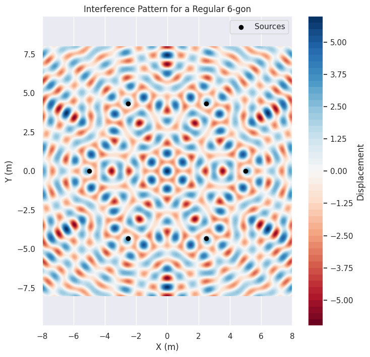

# Problem 1
# Interference Patterns on a Water Surface

## Motivation

Interference occurs when waves from different sources overlap, creating new patterns. On a water surface, this can be easily observed when ripples from different points meet, forming distinctive interference patterns. These patterns can show how waves combine in different ways, either reinforcing each other (constructive interference) or canceling out (destructive interference).

Studying these patterns helps us understand wave behavior in a simple, visual way. It also allows us to explore important concepts, such as the relationship between wave phase and the effects of multiple sources. This task provides a hands-on approach to learning about wave interactions and their real-world applications, offering an engaging way to dive into wave physics.

## Task

We will analyze the interference patterns formed on the water surface due to the superposition of waves emitted from point sources placed at the vertices of a chosen regular polygon.

### Steps to Follow

1. **Select a Regular Polygon**: Choose a regular polygon (e.g., equilateral triangle, square, regular pentagon).
2. **Position the Sources**: Place point wave sources at the vertices of the selected polygon.
3. **Wave Equations**: Write the equations describing the waves emitted from each source, considering their respective positions.

#### 3.1 Wave Equation from a Single Source

A wave emitted from a single point source on the water surface can be described by the following equation:

$$
\text{Displacement at point } (x, y, t) = A \cdot \cos(k \cdot r - \omega t + \phi)
$$

Where:
- \( A \) is the amplitude of the wave,
- \( k \) is the wave number, related to the wavelength \( \lambda \) as: \( k = \frac{2\pi}{\lambda} \),
- \( \omega \) is the angular frequency, related to the frequency \( f \) as: \( \omega = 2\pi f \),
- \( r \) is the distance from the source to the point \( (x, y) \),
- \( t \) is the time,
- \( \phi \) is the initial phase of the wave.

#### 3.2 Superposition of Waves

When there are multiple sources, the resulting displacement at each point on the water surface is the sum of the displacements from each source. This is known as the principle of superposition:

$$
\text{Displacement at point } (x, y, t) = \sum_{i=1}^{n} A \cdot \cos(k \cdot r_i - \omega t + \phi_i)
$$

Where:
- \( n \) is the number of sources (vertices of the polygon),
- \( r_i \) is the distance from the source \( i \) to the point \( (x, y) \),
- \( \phi_i \) is the initial phase of the wave emitted from source \( i \).

4. **Analyze Interference Patterns**: Examine the resulting displacement \( D(x, y, t) \) as a function of position \( (x, y) \) and time \( t \). Identify regions of constructive interference (wave amplification) and destructive interference (wave cancellation).
5. **Visualization**: Present your findings graphically, illustrating the interference patterns for the chosen regular polygon.

### Considerations

- Assume all sources emit waves with the same amplitude \( A \), wavelength \( \lambda \), and frequency \( f \).
- The waves are coherent, maintaining a constant phase difference.
- Use Python libraries such as Matplotlib for visualization and simulation.

## Python Code for Simulation and Visualization

The following Python code simulates the interference patterns of waves from point sources placed at the vertices of a regular polygon. We will use the following libraries: NumPy for numerical calculations and Matplotlib for visualization.

```python
import numpy as np
import matplotlib.pyplot as plt

# ** Constants**
A = 1            # Amplitude of the waves
lambda_wave = 1  # Wavelength (m)
f = 1            # Frequency (Hz)
omega = 2 * np.pi * f  # Angular frequency
k = 2 * np.pi / lambda_wave  # Wave number

# **Parameters for the regular polygon**
n_sides = 5        # Number of sides (vertices) of the polygon (e.g., pentagon)
radius = 5         # Radius of the polygon (distance from center to vertices)
theta_offset = 0   # Offset for the initial phase

# **Generate the positions of the sources (vertices of the polygon)**
angles = np.linspace(0, 2 * np.pi, n_sides, endpoint=False)
sources = np.array([radius * np.cos(angles), radius * np.sin(angles)]).T

# **Generate the grid for the water surface**
x_grid, y_grid = np.meshgrid(np.linspace(-8, 8, 400), np.linspace(-8, 8, 400))
grid_shape = x_grid.shape

# **Calculate the displacement at each point on the grid due to the superposition of waves**
def calculate_displacement(x, y, t):
    displacement = np.zeros_like(x)
    for i in range(n_sides):
        source = sources[i]
        **# Calculate distance from the source to each point on the grid**
        r = np.sqrt((x - source[0])**2 + (y - source[1])**2)
        # Calculate the wave contribution from this source
        displacement += A * np.cos(k * r - omega * t + theta_offset)  # Superposition of waves
    return displacement

# **Simulate and plot the interference pattern at a specific time**
time = 0  # Set the time at which we want to visualize the pattern
displacement = calculate_displacement(x_grid, y_grid, time)

# Plot the interference pattern
plt.figure(figsize=(8, 8))
plt.contourf(x_grid, y_grid, displacement, 50, cmap='RdBu')
plt.colorbar(label='Displacement')
plt.scatter(sources[:, 0], sources[:, 1], color='black', label='Sources', zorder=5)
plt.title(f'Interference Pattern for a Regular {n_sides}-gon')
plt.xlabel('X (m)')
plt.ylabel('Y (m)')
plt.legend()
plt.axis('equal')
plt.show()
.
