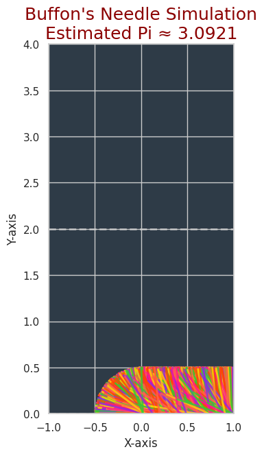

# Problem 2
# Estimating Pi using Monte Carlo Methods

## Motivation:

Monte Carlo simulations are a powerful class of computational techniques that use randomness to solve problems or estimate values. One of the most elegant applications of Monte Carlo methods is estimating the value of π through geometric probability. By randomly generating points and analyzing their positions relative to a geometric shape, we can approximate π in an intuitive and visually engaging way.

This problem connects fundamental concepts of probability, geometry, and numerical computation. It also provides a gateway to understanding how randomness can be harnessed to solve complex problems in physics, finance, and computer science. The Monte Carlo approach to π estimation highlights the versatility and simplicity of this method while offering practical insights into convergence rates and computational efficiency.

---

## Task

### Part 1: Estimating π Using a Circle

#### 1. Theoretical Foundation:

We can estimate the value of π by considering a unit circle (circle with radius = 1) inscribed in a square. The square has side lengths of 2 (extending from -1 to 1 along both axes), and the circle is centered at the origin. The ratio of the area of the circle to the area of the square is:

$$ 
\text{Ratio} = \frac{\text{Area of Circle}}{\text{Area of Square}} = \frac{\pi r^2}{4r^2} = \frac{\pi}{4} 
$$

Thus, if we randomly generate points within the square, the proportion of points that fall inside the circle should be approximately:

$$ 
\frac{\text{Number of points inside the circle}}{\text{Total number of points}} \approx \frac{\pi}{4} 
$$

Therefore, we can estimate π by multiplying the ratio by 4:

$$ 
\pi \approx 4 \times \frac{\text{Number of points inside the circle}}{\text{Total number of points}} 
$$

#### 2. Simulation:

- **Step 1:** Randomly generate points within the square.
- **Step 2:** Check whether the point lies inside the circle using the equation: 
  $$ x^2 + y^2 \leq 1 $$ 
  (where \( x \) and \( y \) are the coordinates of the point).
- **Step 3:** Calculate the ratio of points inside the circle to the total number of points and estimate π.

#### 3. Visualization:

We will create a plot showing the randomly generated points, distinguishing those inside and outside the circle.

---

### Part 2: Estimating π Using Buffon’s Needle

#### 1. Theoretical Foundation:

Buffon’s Needle problem is a classical probability problem where a needle of length \( L \) is dropped onto a floor with parallel lines spaced a distance \( d \) apart. If \( L \leq d \), the probability \( P \) that the needle will cross one of the lines is given by the formula:

$$ 
P = \frac{2L}{\pi d} 
$$

Rearranging this formula, we can solve for π:

$$ 
\pi = \frac{2L}{P d} 
$$

#### 2. Simulation:

- **Step 1:** Drop a needle randomly on a plane with parallel lines.
- **Step 2:** Count how many times the needle crosses a line.
- **Step 3:** Use the formula to estimate π.

#### 3. Visualization:

We will create a graphical representation of the simulation, showing the needle positions relative to the lines.


---


## Python Code Implementation

### Part 1: Estimating π Using the Circle Method

```python
import numpy as np
import matplotlib.pyplot as plt

# Function to estimate Pi using the circle method
def estimate_pi_circle(num_points):
    inside_circle = 0
    x_inside = []
    y_inside = []
    x_outside = []
    y_outside = []

    # Generate random points
    for _ in range(num_points):
        x = np.random.uniform(-1, 1)
        y = np.random.uniform(-1, 1)

        # Check if point is inside the unit circle
        if x**2 + y**2 <= 1:
            inside_circle += 1
            x_inside.append(x)
            y_inside.append(y)
        else:
            x_outside.append(x)
            y_outside.append(y)

    # Estimate pi using the ratio
    pi_estimate = 4 * inside_circle / num_points
    return pi_estimate, x_inside, y_inside, x_outside, y_outside

# Simulate and plot results
num_points = 10000
pi_estimate, x_inside, y_inside, x_outside, y_outside = estimate_pi_circle(num_points)

# Plot
plt.figure(figsize=(6,6))
plt.scatter(x_inside, y_inside, color='blue', s=1, label='Inside Circle')
plt.scatter(x_outside, y_outside, color='red', s=1, label='Outside Circle')
plt.title(f'Estimating Pi: {pi_estimate:.4f}')
plt.xlabel('X')
plt.ylabel('Y')
plt.axhline(0, color='black',linewidth=1)
plt.axvline(0, color='black',linewidth=1)
plt.legend(loc='upper right')
plt.gca().set_aspect('equal', adjustable='box')
plt.show()
import random
 


# Function to estimate Pi using Buffon's Needle method
def estimate_pi_buffon(needle_length, line_distance, num_drops):
    crosses = 0

    # Drop the needle randomly
    for _ in range(num_drops):
        # Randomly choose the angle and the position of the needle's midpoint
        angle = random.uniform(0, np.pi / 2)
        midpoint = random.uniform(0, line_distance / 2)

        # Check if the needle crosses a line
        if midpoint <= (needle_length / 2) * np.sin(angle):
            crosses += 1

    # Estimate pi using the formula
    pi_estimate = (2 * needle_length * num_drops) / (crosses * line_distance)
    return pi_estimate

# Simulate Buffon's Needle and plot results
needle_length = 1.0
line_distance = 2.0
num_drops = 10000

pi_estimate_buffon = estimate_pi_buffon(needle_length, line_distance, num_drops)
print(f'Estimated Pi using Buffon\'s Needle: {pi_estimate_buffon:.4f}')
```