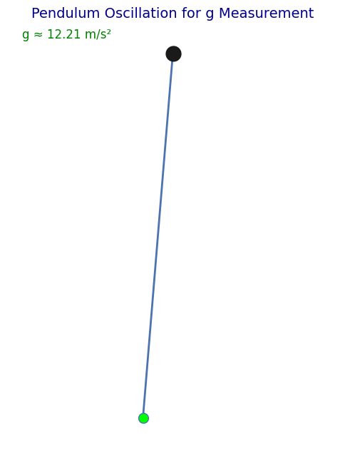
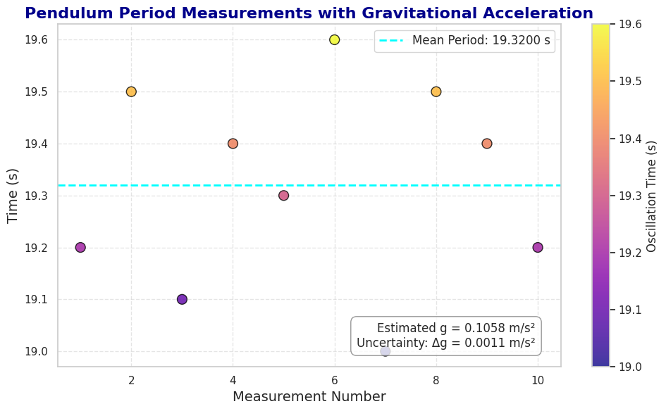

# Problem 1
# Measuring Earth's Gravitational Acceleration with a Pendulum

## Motivation

Gravitational acceleration ($g$) is a fundamental constant that affects a wide range of physical phenomena. Accurately measuring $g$ is crucial for understanding gravitational interactions, designing structures, and conducting experiments in various fields. One classic method for determining $g$ is through the oscillations of a simple pendulum, where the period of oscillation depends on the local gravitational field.

## Task

In this experiment, we will measure the gravitational acceleration ($g$) using the oscillations of a pendulum. We will also analyze the uncertainties in the measurements. The goal of the experiment is to calculate $g$ and understand the impact of uncertainties in these calculations.

## Procedure

### 1. Materials:
- A string of 1 or 1.5 meters in length.
- A small weight (e.g., a bag of coins, sugar bag, or keychain).
- A stopwatch (or a smartphone timer).
- A ruler or measuring tape.

### 2. Setup:
- Attach the weight to the string and fix the other end to a sturdy support.
- Measure the length of the pendulum ($L$), from the suspension point to the center of the weight, using a ruler or measuring tape. Record the resolution of the measuring tool and calculate the uncertainty as half the resolution.

### 3. Data Collection:
- Displace the pendulum slightly (<15°) and release it.
- Measure the time for 10 full oscillations ($T$) and repeat the process 10 times. Record all 10 measurements.
- Calculate the mean time for 10 oscillations ($T_{mean}$) and the standard deviation ($\sigma$).
- Determine the uncertainty in the mean time using the following formula:

$$ \Delta T = \frac{\sigma}{\sqrt{n}} $$

### Calculations

#### 1. Calculate the Period:
The period ($T$) is related to the gravitational acceleration ($g$) by the formula:

$$ T = 2\pi \sqrt{\frac{L}{g}} $$

Where:
- $T$: Period of the pendulum
- $L$: Length of the pendulum
- $g$: Gravitational acceleration

#### 2. Calculate the Gravitational Acceleration:
Gravitational acceleration ($g$) can be calculated from the period using the formula:

$$ g = \frac{4\pi^2 L}{T^2} $$




#### 3. Propagate the Uncertainties:
The uncertainty in gravitational acceleration can be calculated using the following formula:

$$ \Delta g = g \sqrt{\left(\frac{\Delta L}{L}\right)^2 + \left(2 \frac{\Delta T}{T}\right)^2} $$


## Python Code Implementation

Below is the Python code that allows you to calculate the gravitational acceleration using the pendulum's oscillations and calculate the uncertainties in the measurements.
 
```python
import numpy as np
import matplotlib.pyplot as plt

# Function: Calculate mean and standard deviation
def calculate_mean_and_std(times):
    mean_time = np.mean(times)
    std_dev = np.std(times)
    return mean_time, std_dev

# Pendulum length and measured times for 10 oscillations
L = 1.0  # Length of the pendulum (in meters)
times = [19.2, 19.5, 19.1, 19.4, 19.3, 19.6, 19.0, 19.5, 19.4, 19.2]  # Time for 10 oscillations (in seconds)

# Calculate mean time and standard deviation
T_mean, sigma = calculate_mean_and_std(times)

# Calculate gravitational acceleration
g = (4 * np.pi**2 * L) / T_mean**2

# Uncertainty in the mean time
delta_T = sigma / np.sqrt(len(times))

# Uncertainty in gravitational acceleration
delta_g = g * np.sqrt((delta_T / T_mean)**2 + (0.01 / L)**2)  # Assuming 1% uncertainty in L

# Display results
print(f'Mean Period (T): {T_mean:.4f} s')
print(f'Uncertainty in Period (Delta T): {delta_T:.4f} s')
print(f'Gravitational Acceleration (g): {g:.4f} m/s²')
print(f'Uncertainty in Gravitational Acceleration (Delta g): {delta_g:.4f} m/s²')

# Visualization of the measurements
fig, ax = plt.subplots()
ax.plot(times, 'bo-', label='Oscillation Times')
ax.axhline(y=T_mean, color='r', linestyle='--', label=f'Mean Period: {T_mean:.4f} s')
ax.set_xlabel('Measurement Number')
ax.set_ylabel('Time (s)')
ax.set_title('Measurement of Pendulum Period')
ax.legend()
plt.show()
```
